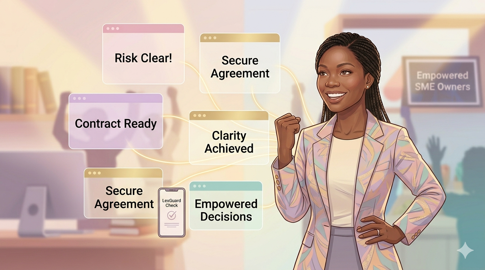

# 🛡️ LexGuard — Contract Risk Analyzer for SMEs

LexGuard is a lightweight, privacy-first contract analysis tool designed to help entrepreneurs and small businesses quickly identify potentially risky clauses in agreements.

It uses rule-based pattern matching to highlight clauses related to liability, exclusivity, termination, and more; guiding users to the most important parts of a contract for further review.

## 🚀 Features

* 🔍 **Clause Detection** : Identifies key legal clauses using regex-based rules

* ⚠️ **Risk Classification** : Assigns High, Medium, Low risk levels

* 💬 **Contextual Warnings** : Explains why a clause may be risky

* 📊 **Visual Analysis** : Displays risk distribution (chart view)

* 📁 **File Upload Support** : Analyze .txt and .pdf contracts

* 🔐 **Privacy-First** : Runs entirely in the browser (no data storage)

* 📥 **JSON Export** : Download structured analysis results

## 🧠 Approach

LexGuard combines data-driven insights with rule-based NLP techniques.

Contract clause patterns were derived from structured legal text analysis

These patterns were translated into regex-based detection rules

Rules are organized into modular JSON files:

 - rules.json

 - severity_mapping.json

 - warning_messages.json

This design allows the system to be easily updated without modifying core logic.

## ⚙️ Key Technical Decision

Initially, TF-IDF was explored alongside rule-based detection.

However:

It introduced noise by flagging common words (e.g., “agreement”, “terms”, "use")

This led to inflated and less meaningful risk scores

👉 The system was refined to use pure regex-based pattern matching, improving precision and interpretability.

## 🧩 System Design

LexGuard is built with a modular architecture:

* Frontend: HTML, CSS, JavaScript

* Analysis Engine: Regex-based clause detection

* Data Layer: JSON-driven rules and mappings

* Deployment: Netlify (frontend hosting)

## ⚡ Development Workflow

This project was built using a vibe coding / no-code assisted workflow, combining:

- ChatGPT

- Anti Gravity AI

- GitHub

- Netlify

This enabled rapid prototyping, debugging, and iteration.

## 🚧 Challenges & Learnings

* Managing compute and model access limitations

* Adapting by switching between AI models and optimizing prompts

* Debugging deployment issues (e.g., backend limitations on Netlify)

* Transitioning to a fully client-side architecture

## 🔐 Privacy by Design

LexGuard does not store or transmit contract data.

* All analysis runs locally in the browser

* No database or backend storage

* Users maintain full control of their documents

## 📦 Output

The system generates a structured JSON report:

{
  "overall_risk": "Medium",
  "risk_score": 45,
  "risk_counts": {
    "High": 2,
    "Medium": 5,
    "Low": 3
  },
  "flags": [...]
}

This allows for further analysis or integration into other workflows.

## 🎯 Use Cases

* SME contract review

* Pre-legal review screening

* Legal awareness and education

* Data-driven contract analysis

## ⚠️ Disclaimer

LexGuard is an rule-based contract analysis tool designed to support contract review.

It does not provide legal advice and should not replace consultation with a qualified legal professional.

## 🎬 Demo Video

  

👉 Click the image above to watch the demo.

## 🌍 Live Demo

👉 https://lexguard20.netlify.app/

## 👩🏽‍💻 Author

Latifah Bashir
3MTT Fellow (AI/ML Track)
Data Science & Analytics Enthusiast

